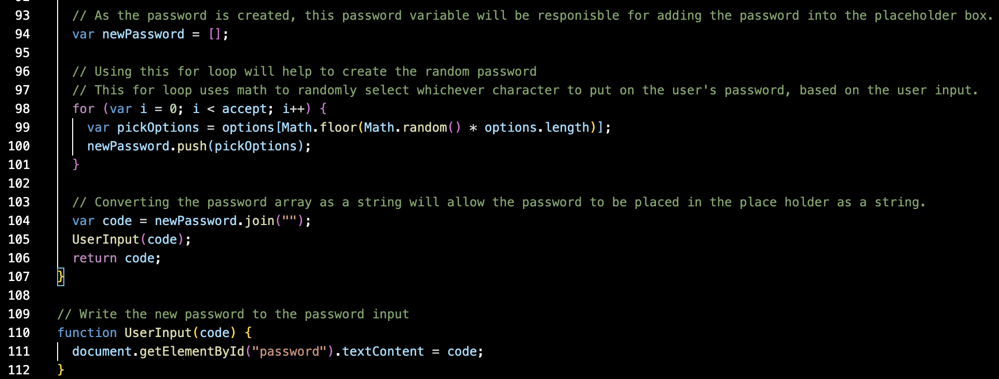

# Password Generator

This project will help to create a random password based on the user's input. I focused on using mainly javascript to complete this project.

## Objectives

Step 1, when I click on the "Generate Password" button, I will be sent a series of window promts that takes user input to create the a certain password.
Step 2, when prompted for password criteria, then the user is able to pick and choose which criteria will be included in their password. 
Step 3, when creating the new generated password, the user is given the option to pick the length of the password ranging from 8 to 128 characters for the password. 
Step 4, when the user is being prompted with the criteria to meet their standards, the user is able to confirm whether or not to include the lowercase letters, the caplized letters, numbers, and/or the special characters. 
Step 5, when the user answers each prompt, then the user input should be validated and at least one character type will be selected and put into the generated password according to the user input. 
Step 6, when all prompts have been asnwered, the user should receive their own newly generated password that matched their user input from the prompts. 
Step 7, when the user generates their password, then the password is shown on the page.

## Step 1

As you can see at the start of the function, the user will be prompted, and by answering the prompt correctly they will be sent a series of window prompts.

## Step 2

In this code, you will be able to see the user will be sent window prompts that will give the user the opportunity to confirm or decline the options to edit their password with the use of our criteria tha is being given to the user.

## Step 3

In this image we can see that the user will be prompted to choose the length of the password ranging from 8 to 128 characters. We can also see from this bit of code that if the user chooses a character that is not 8, 128, or in between, then user will be prompted to another response. Furthermore, in the later piece of this code we can see that if the user's input is less than 8 or greater than 128, then the another window prompt will be sent the user as a response to inform the user.

## Steps 4 and 5

For step four, here in this long string of code, we can see the outcomes that the user is able to possibly have when choosing their own criteria. At the very top of the image we can see that the user is infact able to accept or decline the various criteria given to them at the start.

For Step five, we are then able to see below that top part of the code which shows all the possible outcomes for the user input. With each prompt the user input will be validated and will select at least one character type from the user's input to put into their newly generated password.

## Step 6

-image.png)

In this first image, the code that is being displayed are all the outcome that are presented to the user based on the user's input.

-image.png)

In this next image, this where the user will end up getting their results from based on what the user input and how it is randomly created using a for loop. This for loop gets random characters from the arrays that the user input had wanted in their password which were also being refered to as the "criteria" being given to them to create their password.

## Step 7

Lastly, in this image we can see that once the password is done with is user input taking process, that the variable "code" also known as the password is being used as a string at the end of the function. With this in place, we can make a another function that places and writes that string into the placeholder box on the webpage which the user can receive the password from.